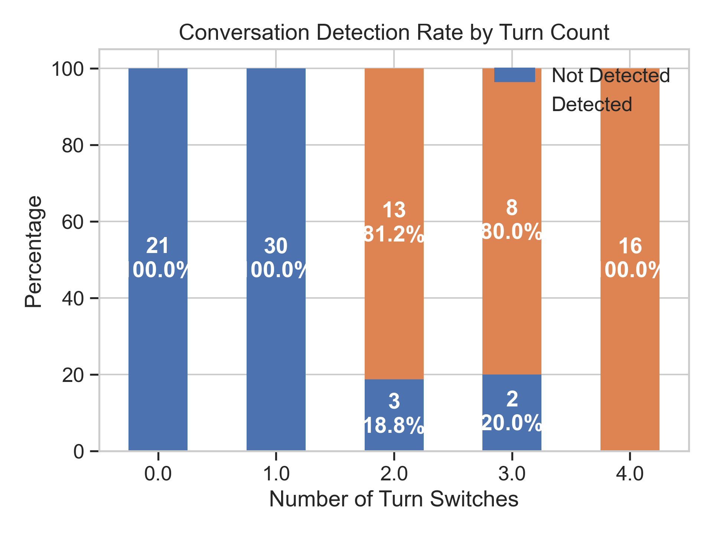

# Conversation Detection Analysis Report - Low Turns
Generated on: 2025-05-29 12:32:01

## Overview

This report analyzes conversation detection results for calls with fewer than 5 turn switches.

### Key Statistics

- **Total Calls Analyzed**: 93
- **Conversations Detected**: 37 (39.8%)
- **No Conversation Detected**: 56 (60.2%)

## Analysis by Turn Count

| Turn Switches | Total Calls | Conversations Detected | Detection Rate | Avg Confidence | Avg Caller Speech | Avg Receiver Speech |
|--------------|-------------|----------------------|----------------|----------------|------------------|-------------------|
| 0.0 | 21 | 0 | 0.0% | 0.181 | 1.08s | 0.53s |
| 1.0 | 30 | 0 | 0.0% | 0.458 | 2.44s | 1.53s |
| 2.0 | 16 | 13 | 81.2% | 0.818 | 3.19s | 1.75s |
| 3.0 | 10 | 8 | 80.0% | 0.745 | 4.80s | 1.68s |
| 4.0 | 16 | 16 | 100.0% | 0.930 | 3.80s | 2.86s |

## Visualizations

### 1. Conversation Detection Rate by Turn Count

This plot shows the distribution of conversation detection results for each turn count:

### 2. Confidence Score Distribution

This plot shows the distribution of confidence scores by turn count and detection status:

### 3. Speech Duration Analysis

This plot compares caller and receiver speech durations, with bubble size representing total conversation duration:

## Key Findings

1. **Turn Count Impact**: The analysis shows how conversation detection rates vary with the number of turn switches.
2. **Speech Duration Patterns**: The speech duration comparison reveals patterns in caller vs receiver speech distribution.
3. **Confidence Score Trends**: The confidence score distribution helps understand the reliability of detection at different turn counts.

## Methodology

- Analysis focused on calls with 0-4 turn switches
- Conversation detection based on speech presence, turn-taking patterns, and duration
- Confidence scores reflect the certainty of conversation detection
